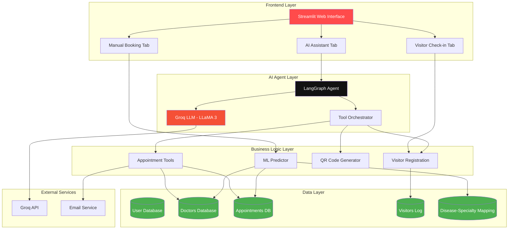

# 🏥 AI Receptionist - Intelligent Healthcare Appointment System

[](https://www.python.org/)
[](https://streamlit.io/)
[](https://langchain.com/)
[](https://langchain-ai.github.io/langgraph/)
[](https://groq.com/)
[](https://opensource.org/licenses/MIT)

> An intelligent AI-powered receptionist system built with LangGraph and Streamlit that automates appointment booking, visitor management, and patient interactions using advanced conversational AI.

---

## 📋 Table of Contents

- [Overview](#-overview)
- [System Architecture](#-system-architecture)
- [Key Features](#-key-features)
- [Technology Stack](#-technology-stack)
- [Installation](#-installation)
- [Configuration](#-configuration)
- [Usage](#-usage)
- [Project Structure](#-project-structure)
- [API Integration](#-api-integration)
- [Contributing](#-contributing)
- [License](#-license)

---

## 🎯 Overview

The **AI Receptionist** is a comprehensive healthcare appointment management system that leverages cutting-edge AI technology to provide:

- **Conversational AI Interface**: Natural language interaction powered by Groq's LLaMA 3 model
- **Smart Appointment Scheduling**: ML-based optimal time slot predictions
- **Visitor Management**: Photo capture and registration system
- **Multi-modal Booking**: AI chat, manual booking, and voice interaction support
- **Real-time Analytics**: Dashboard with appointment statistics and insights

---

## 🏗️ System Architecture



### Architecture Components

| Component           | Technology            | Purpose                                                           |
| ------------------- | --------------------- | ----------------------------------------------------------------- |
| **Frontend**        | Streamlit             | Interactive web interface with tabs for different functionalities |
| **AI Agent**        | LangGraph + LangChain | Orchestrates conversational flow and tool execution               |
| **LLM**             | Groq (LLaMA 3 70B)    | Natural language understanding and generation                     |
| **ML Engine**       | Scikit-learn          | Predicts optimal appointment times                                |
| **Data Storage**    | SQLite + SQLAlchemy   | Persistent storage for users, appointments, doctors               |
| **QR Generation**   | qrcode library        | Creates appointment confirmation QR codes                         |
| **Computer Vision** | OpenCV                | Captures visitor photos during check-in                           |

---

## ✨ Key Features

### 🤖 AI-Powered Conversational Interface

- Natural language appointment booking and cancellation
- Context-aware responses using LangGraph state management
- Multi-turn conversations with memory
- Intelligent tool calling for complex operations

### 📅 Smart Appointment Management

- **ML-Based Scheduling**: Predicts optimal appointment times based on historical data
- **Availability Checking**: Real-time slot verification
- **Conflict Prevention**: Automatic detection of scheduling conflicts
- **Multi-Doctor Support**: Specialty-based doctor assignment
- **QR Code Generation**: Digital appointment confirmations

### 👥 Visitor Management System

- Photo capture using webcam
- Purpose and company tracking
- Timestamped visitor logs
- Searchable visitor history

### 🔐 User Authentication

- Secure login/registration system
- Password hashing with SHA-256
- Session state management
- User profile tracking

### 📊 Analytics Dashboard

- Real-time appointment statistics
- Visitor count tracking
- Doctor availability overview
- Visual metrics and insights

### 🎨 Modern UI/UX

- Custom CSS styling with glassmorphism effects
- Responsive design
- Professional healthcare theme
- Interactive components

---

## 🛠️ Technology Stack

### Core Technologies

| Category            | Technologies                                       |
| ------------------- | -------------------------------------------------- |
| **AI/ML**           | LangGraph, LangChain, Groq API, Scikit-learn       |
| **Frontend**        | Streamlit, Custom CSS                              |
| **Backend**         | Python 3.8+                                        |
| **Data**            | SQLite, SQLAlchemy, Pandas                         |
| **Computer Vision** | OpenCV                                             |
| **Utilities**       | QR Code, python-dotenv, pyttsx3, SpeechRecognition |

### Dependencies

```
langgraph
langchain_community
langchain_openai
langchain_core
langchain-groq
python-dotenv
streamlit
opencv-python
pandas
scikit-learn
qrcode
pyttsx3
SpeechRecognition
sqlalchemy>=2.0.0
plotly
```

---

## 🚀 Installation

### Prerequisites

- Python 3.8 or higher
- pip package manager
- Groq API key ([Get one here](https://console.groq.com/))
- Webcam (optional, for visitor check-in)

### Step-by-Step Installation

1. **Clone the Repository**

   ```bash
   git clone https://github.com/Manojkumarw13/AI-Receptionist.git
   cd AI-Receptionist
   ```

2. **Create Virtual Environment** (Recommended)

   ```bash
   python -m venv .venv

   # On Windows
   .venv\Scripts\activate

   # On macOS/Linux
   source .venv/bin/activate
   ```

3. **Install Dependencies**

   ```bash
   cd AI_Receptionist_LangGraph-main
   pip install -r requirements.txt
   ```

4. **Set Up Environment Variables**

   Create a `.env` file in the `AI_Receptionist_LangGraph-main` directory:

   ```env
   GROQ_API_KEY=your_groq_api_key_here
   ```

5. **Verify Installation**
   ```bash
   streamlit run streamlit_app.py
   ```

---

## ⚙️ Configuration

### Environment Variables

Create a `.env` file with the following variables:

```env
# Required
GROQ_API_KEY=your_groq_api_key_here

# Optional Email Configuration (for notifications)
SMTP_SERVER=smtp.gmail.com
SMTP_PORT=587
EMAIL_ADDRESS=your_email@gmail.com
EMAIL_PASSWORD=your_app_password
```

### Database Configuration

The system uses **SQLite database** with **SQLAlchemy ORM** for data persistence:

- **`receptionist.db`**: SQLite database file containing all application data
- **Database Tables**:
  - `users`: User accounts and authentication
  - `doctors`: Doctor profiles and specialties
  - `appointments`: Appointment records
  - `disease_specialties`: Disease to specialty mapping
  - `visitors`: Visitor check-in logs

**Migration**: Use `migrate_json_to_db.py` to migrate from JSON files to database

### Star Schema Analytics Database

The system includes a **star schema data warehouse** (`receptionist_star.db`) optimized for analytics and business intelligence:

#### Star Schema Architecture

```
                    ┌─────────────────┐
                    │   dim_date      │
                    │  (1,096 rows)   │
                    └────────┬────────┘
                             │
        ┌────────────────────┼────────────────────┐
        │                    │                    │
┌───────▼────────┐  ┌────────▼────────┐  ┌───────▼────────┐
│   dim_time     │  │ fact_appointments│  │  dim_doctor    │
│   (26 rows)    ├──┤   (500+ rows)   ├──┤   (60 rows)    │
└────────────────┘  └────────┬────────┘  └────────────────┘
                             │
        ┌────────────────────┼────────────────────┐
        │                    │                    │
┌───────▼────────┐  ┌────────▼────────┐  ┌───────▼────────┐
│   dim_user     │  │  dim_disease    │  │  dim_visitor   │
│  (100 rows)    │  │   (60 rows)     │  │   (10 rows)    │
└────────────────┘  └─────────────────┘  └────────────────┘
```

#### Dimension Tables

| Table           | Description          | Key Attributes                                     |
| --------------- | -------------------- | -------------------------------------------------- |
| **dim_date**    | Calendar dimension   | year, quarter, month, day, is_weekend, is_holiday  |
| **dim_time**    | Time slots           | hour, minute, time_slot, period, is_business_hours |
| **dim_doctor**  | Doctor profiles      | name, specialty, experience, rating, fees          |
| **dim_user**    | Patient demographics | email, age, gender, blood_group, city              |
| **dim_disease** | Disease catalog      | disease_name, specialty, severity, ICD code        |
| **dim_visitor** | Visitor profiles     | name, company, purpose, contact                    |

#### Fact Tables

| Table                     | Description              | Measures                               |
| ------------------------- | ------------------------ | -------------------------------------- |
| **fact_appointments**     | Appointment transactions | status, duration, fees, payment_status |
| **fact_visitor_checkins** | Visitor check-ins        | checkin_time, checkout_time, duration  |

#### Analytics Capabilities

The star schema enables powerful analytics queries:

- **Peak Hours Analysis**: Identify busiest appointment times
- **Doctor Performance**: Track appointments, completion rates, revenue
- **Disease Trends**: Monitor common conditions by season/time
- **Patient Demographics**: Analyze age groups, locations, visit patterns
- **Revenue Analysis**: Track income by specialty, doctor, time period
- **Resource Utilization**: Optimize doctor schedules and availability

#### Using the Analytics Dashboard

Access the analytics dashboard from the navigation menu:

```python
# The dashboard provides:
- 📊 Key metrics (total appointments, completion rate)
- ⏰ Peak appointment hours visualization
- 👨‍⚕️ Popular doctors ranking
- 💰 Revenue breakdown by specialty
- 🏥 Disease trend analysis
- 👥 Patient demographics charts
```

#### Populating Star Schema

```bash
# Generate sample data for analytics
python populate_star_schema.py
```

This creates:

- 1,096 date records (2024-2026)
- 26 time slots (30-minute intervals)
- 60 doctors across 15 specialties
- 100 sample patients
- 60 diseases with ICD codes
- 500+ appointment records

### Customization

#### Change Logo or Background

```python
# Update paths in streamlit_app.py
LOGO_PATH = "static/images/current/logo.png"
BACKGROUND_PATH = "static/images/current/medical_technology.jpg"
```

#### Modify AI Behavior

Edit the system prompt in `caller_agent.py`:

```python
caller_pa_prompt = """You are a smart AI Receptionist.
[Customize your AI's personality and capabilities here]
"""
```

---

## 📖 Usage

### Starting the Application

```bash
cd AI_Receptionist_LangGraph-main
streamlit run streamlit_app.py
```

The application will open in your default browser at `http://localhost:8501`

### User Workflow

#### 1. **Login/Register**

- Create a new account or login with existing credentials
- Credentials are securely hashed and stored

#### 2. **AI Assistant Tab**

- Chat naturally with the AI receptionist
- Example queries:
  - "I need to book an appointment for next Monday at 2 PM"
  - "What's the next available slot with a cardiologist?"
  - "Cancel my appointment on March 15th"
  - "Generate a QR code for my appointment"

#### 3. **Visitor Check-in Tab**

- Capture visitor photo using webcam
- Enter visitor details (name, purpose, company)
- Submit to log the visit

#### 4. **Manual Booking Tab**

- **Step 1**: Select disease/condition
- **Step 2**: Choose from recommended doctors
- **Step 3**: Pick date and time (with ML-based suggestions)
- **Step 4**: Confirm appointment details

#### 5. **Analytics Dashboard Tab**

- View comprehensive business intelligence reports
- Analyze peak appointment hours
- Track doctor performance and revenue
- Monitor disease trends and patient demographics
- Export data for further analysis

### Sample Interactions

#### Booking an Appointment

```
User: "I need to see a doctor for diabetes next week"
AI: "I can help you book an appointment with an endocrinologist.
     Let me check the next available slots..."
```

#### Checking Availability

```
User: "Is Dr. Smith available on March 20th at 3 PM?"
AI: "Let me check the availability... Yes, that slot is available
     and optimal based on our scheduling analysis."
```

---

## 📁 Project Structure

```
AI_Receptionist_LangGraph-main/
│
├── 📄 Main Application Files
│   ├── streamlit_app.py          # Main Streamlit application
│   ├── caller_agent.py            # LangGraph agent for AI conversations
│   ├── tools.py                   # Tool functions for agent
│   ├── ml_utils.py                # Machine learning utilities
│   ├── requirements.txt           # Python dependencies
│   ├── .env                       # Environment variables (API keys)
│   └── .gitignore                 # Git ignore rules
│
├── 📁 data/                       # Data Files
│   ├── appointments.json          # Appointment records
│   ├── doctors.json               # Doctor information
│   ├── user_data.json             # User accounts
│   ├── disease_specialties.json   # Disease to specialty mapping
│   └── visitors.json              # Visitor check-in records
│
├── 📁 static/                     # Static Assets
│   ├── styles.css                 # Custom CSS styling
│   └── images/                    # Images and logos
│       ├── current/               # Active images
│       ├── logos/                 # Logo options
│       └── backgrounds/           # Background images
│
└── 📁 screenshots/                # Application Screenshots
    └── appointment_booked.png     # Demo screenshots
```

### Key Files Explained

| File               | Purpose                                         |
| ------------------ | ----------------------------------------------- |
| `streamlit_app.py` | Main application entry point with UI components |
| `caller_agent.py`  | LangGraph workflow definition and agent logic   |
| `tools.py`         | Decorated functions for appointment operations  |
| `ml_utils.py`      | Machine learning models for time prediction     |
| `requirements.txt` | Python package dependencies                     |

---

## 🔌 API Integration

### Groq API

The system uses Groq's API for LLM inference:

```python
from langchain_groq import ChatGroq

llm = ChatGroq(
    model="llama3-70b-8192",
    temperature=0.5,
    api_key=os.getenv("GROQ_API_KEY")
)
```

**Supported Models:**

- `llama3-70b-8192` (default)
- `llama3-8b-8192`
- `mixtral-8x7b-32768`

### Tool Functions

The AI agent has access to these tools:

| Tool                             | Description                     |
| -------------------------------- | ------------------------------- |
| `book_appointment`               | Books a new appointment         |
| `cancel_appointment`             | Cancels an existing appointment |
| `get_next_available_appointment` | Finds next available slot       |
| `check_availability_ml`          | ML-based availability check     |
| `generate_qr_code`               | Creates QR code for appointment |
| `register_visitor`               | Logs visitor check-in           |

---

## 🤝 Contributing

Contributions are welcome! Please follow these steps:

1. **Fork the Repository**

   ```bash
   git fork https://github.com/Manojkumarw13/AI-Receptionist.git
   ```

2. **Create a Feature Branch**

   ```bash
   git checkout -b feature/amazing-feature
   ```

3. **Commit Your Changes**

   ```bash
   git commit -m "Add amazing feature"
   ```

4. **Push to Branch**

   ```bash
   git push origin feature/amazing-feature
   ```

5. **Open a Pull Request**

### Development Guidelines

- Follow PEP 8 style guidelines
- Add docstrings to all functions
- Test thoroughly before submitting
- Update documentation for new features

---

## 📝 License

This project is licensed under the MIT License - see the [LICENSE](LICENSE) file for details.

---

## 🙏 Acknowledgments

- **LangChain & LangGraph**: For the powerful agent framework
- **Groq**: For lightning-fast LLM inference
- **Streamlit**: For the intuitive web framework
- **Unsplash**: For healthcare images
- **Flaticon**: For medical icons

---

## 📧 Contact

**Manoj Kumar**

- GitHub: [@Manojkumarw13](https://github.com/Manojkumarw13)
- Project Link: [https://github.com/Manojkumarw13/AI-Receptionist](https://github.com/Manojkumarw13/AI-Receptionist)

---

## 🔮 Future Enhancements

- [ ] Multi-language support
- [ ] Voice-based appointment booking
- [ ] SMS/WhatsApp notifications
- [ ] Integration with electronic health records (EHR)
- [ ] Advanced analytics and reporting
- [ ] Mobile application
- [ ] Payment gateway integration
- [ ] Telemedicine integration

---

<div align="center">

**⭐ Star this repository if you find it helpful!**

Made with ❤️ using LangGraph and Streamlit

</div>
