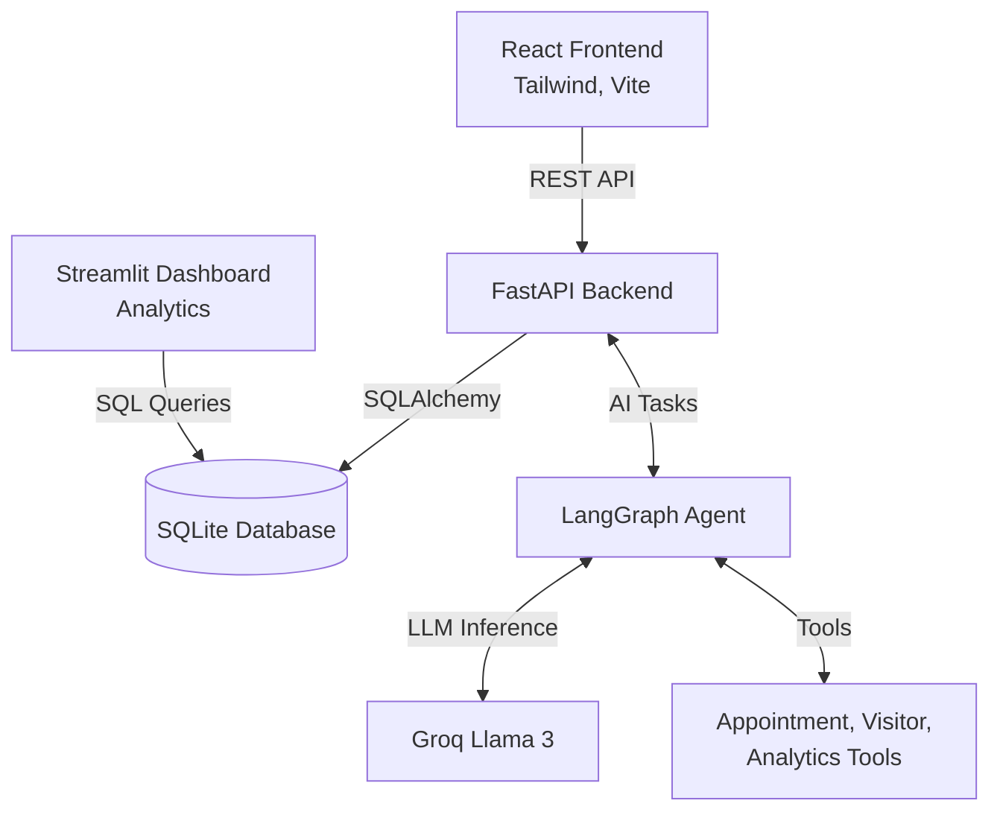

# 🤖 AI Receptionist - Intelligent Healthcare Management System

[](https://www.python.org/downloads/)
[](https://fastapi.tiangolo.com/)
[](https://reactjs.org/)
[](https://streamlit.io/)
[](https://www.langchain.com/)
[](https://groq.com/)
[](LICENSE)
[](https://github.com/Manojkumarw13/AI-Receptionist)
An intelligent AI-powered receptionist system for healthcare facilities, built with LangGraph and Streamlit. Features automated appointment booking, visitor management, ML-based scheduling optimization, and comprehensive analytics.

## ✨ Features

### 🎯 Core Functionality

- **AI-Powered Chatbot**: Natural language appointment booking and management
- **Smart Scheduling**: ML-based appointment optimization and conflict prevention
- **Visitor Management**: Digital check-in system with photo capture
- **QR Code Generation**: Automatic QR codes for appointment confirmations
- **Real-time Analytics**: Comprehensive dashboard with business intelligence

### 🔒 Security & Data

- **bcrypt Password Hashing**: Industry-standard password security
- **Session-based Authentication**: Secure user sessions
- **Input Validation**: File size/type validation, email verification
- **Soft Delete**: Data retention for historical analysis
- **Timezone Support**: Proper timezone-aware datetime handling

### 📊 Analytics & Reporting

- **Star Schema Database**: Optimized for analytics queries
- **Interactive Dashboards**: Plotly-powered visualizations
- **Peak Hours Analysis**: Identify busy periods
- **Doctor Performance**: Track appointments and ratings
- **Revenue Tracking**: Specialty-wise revenue breakdown

## 🏗️ Architecture

The system is built on a modern stack featuring a **React + Vite** frontend with **Tailwind CSS**, a **FastAPI** REST backend, and an intelligent **LangGraph** agent.


```mermaid
graph TD
    Client[React Frontend <br/> Tailwind, Vite] -->|REST API| API[FastAPI Backend]
    API -->|SQLAlchemy| DB[(SQLite Database)]
    API <-->|AI Tasks| Agent[LangGraph Agent]
    Agent <-->|LLM Inference| Groq[Groq Llama 3]
    Agent <-->|Tools| Tools[Appointment, Visitor,<br/>Analytics Tools]
    Dashboard[Streamlit Dashboard <br/> Analytics] -->|SQL Queries| DB
```

## 🚀 Quick Start

### Prerequisites

- Python 3.9 or higher
- Node.js 18+ (for frontend)
- Git
- Groq API key ([Get one here](https://console.groq.com/))

### Installation

1. **Clone the repository**

```bash
git clone https://github.com/Manojkumarw13/AI-Receptionist.git
cd AI-Receptionist
```

#### Backend Setup

2. **Navigate to the backend directory and create a virtual environment**

```bash
cd backend
python -m venv venv
source venv/bin/activate  # On Windows: venv\Scripts\activate
```

3. **Install dependencies**

```bash
pip install -r requirements.txt
```

4. **Set up environment variables**

```bash
# Create .env file
cp .env.example .env

# Edit .env and add your credentials
GROQ_API_KEY=your_groq_api_key_here
EMAIL=your_email@gmail.com  # Optional
EMAIL_PASSWORD=your_app_password  # Optional
TIMEZONE=Asia/Kolkata  # Optional
```

5. **Run the backend application**

```bash
uvicorn main:app --reload --port 8000
```

The FastAPI backend will start at `http://localhost:8000`
API documentation is available at `http://localhost:8000/docs`

#### Frontend Setup

1. **Open a new terminal window, navigate to the frontend directory**

```bash
cd frontend
```

2. **Install node dependencies**

```bash
npm install
```

3. **Run the frontend application**

```bash
npm run dev
```

The application will open in your browser at `http://localhost:5173`

## 📁 Project Structure

```
AI-Receptionist/
├── backend/                    # FastAPI backend
│   ├── agent/                  # LangGraph agent workflows
│   ├── api/                    # REST API routes & schemas
│   │   ├── routes/             # Endpoint modules
│   │   │   ├── appointment_routes.py
│   │   │   ├── auth_routes.py
│   │   │   ├── availability_routes.py
│   │   │   ├── chat_routes.py
│   │   │   ├── doctor_routes.py
│   │   │   └── visitor_routes.py
│   │   ├── auth.py             # Authentication logic
│   │   └── schemas.py          # Pydantic models
│   ├── database/               # Database models and connections
│   ├── data/                   # Initial data files
│   ├── utils/                  # Utility modules (ML, logging, email)
│   ├── scripts/                # Setup & utility scripts
│   ├── tests/                  # Test suite
│   ├── main.py                 # FastAPI application entry point
│   ├── config.py               # Configuration settings
│   └── requirements.txt        # Python dependencies
├── frontend/                   # React frontend
│   └── ui/                     # Vite + React app
│       ├── src/
│       │   ├── pages/          # Page components
│       │   │   ├── LoginPage.jsx
│       │   │   ├── AppointmentsPage.jsx
│       │   │   ├── AiAssistantPage.jsx
│       │   │   └── VisitorCheckInPage.jsx
│       │   ├── components/     # Reusable UI components
│       │   ├── context/        # React context providers
│       │   ├── services/       # API service layer
│       │   ├── layouts/        # Layout components
│       │   └── App.jsx         # Root component with routing
│       ├── package.json        # Node.js dependencies
│       └── vite.config.js      # Vite configuration
├── requirements.txt            # Root dependencies
├── LICENSE                     # MIT License
└── README.md                   # This file
```

## 🎨 Usage

### 1. User Registration/Login

- Create an account with email and password
- Password requirements: 8+ chars, uppercase, lowercase, number

### 2. AI Assistant

- Chat naturally: "Book an appointment with Dr. Smith tomorrow at 2 PM"
- Cancel appointments: "Cancel my appointment on Feb 20"
- Check availability: "When is Dr. Johnson available?"

### 3. Visitor Check-in

- Register visitors with name, purpose, and company
- Optional photo capture
- Automatic timestamp logging

### 4. Manual Booking

- Select disease/specialty
- Choose doctor
- Pick date and time
- ML-powered scheduling suggestions

### 5. Analytics Dashboard

- View appointment statistics
- Track doctor performance
- Analyze peak hours
- Monitor revenue by specialty

## 🛠️ Technology Stack

### Backend

- **FastAPI**: High-performance Python REST API framework
- **LangChain & LangGraph**: AI agent orchestration
- **Groq**: LLM inference (Llama 3 70B)
- **SQLAlchemy**: ORM and database management
- **SQLite**: Dual database (operational + analytics star schema)
- **bcrypt**: Password hashing
- **Pydantic**: Request/response validation
- **pytz**: Timezone handling

### Frontend

- **React 18**: Component-based UI framework
- **Vite**: Fast build tool and dev server
- **Tailwind CSS**: Utility-first CSS framework
- **React Router**: Client-side routing

### ML & AI

- **scikit-learn**: Appointment prediction
- **pandas**: Data processing
- **Custom ML predictor**: Scheduling optimization

## 📊 Database Schema

### Operational Database

- **users**: User accounts and profiles
- **doctors**: Doctor information and specialties
- **appointments**: Appointment records (with soft delete)
- **visitors**: Visitor check-in logs
- **disease_specialties**: Disease-specialty mappings

### Analytics Database (Star Schema)

- **Dimensions**: Date, Time, Doctor, User, Disease, Visitor
- **Facts**: Appointments, Visitor Check-ins

## 🔧 Configuration

Edit `config.py` or set environment variables:

```python
# Timezone
TIMEZONE=Asia/Kolkata

# File Upload Limits
MAX_IMAGE_SIZE_MB=5
ALLOWED_IMAGE_TYPES=JPEG,PNG,GIF

# Database
DB_POOL_SIZE=5
DB_MAX_OVERFLOW=10

# Pagination
DEFAULT_PAGE_SIZE=50
MAX_PAGE_SIZE=100

# Working Hours
WORKING_HOURS_START=9
WORKING_HOURS_END=17

# Appointment Settings
APPOINTMENT_SLOT_DURATION_MINUTES=30
AVAILABILITY_SEARCH_DAYS=7
```

## 🧪 Testing

```bash
# Run tests
python -m pytest tests/

# Test specific module
python -m pytest tests/test_star_schema.py

# With coverage
python -m pytest --cov=. tests/
```

## 📝 API Documentation

See [API_DOCUMENTATION.md](API_DOCUMENTATION.md) for detailed API reference including:

- Tool descriptions and parameters
- Response formats and error codes
- Authentication flow
- Database schema details

## 🔐 Security

See [SECURITY.md](SECURITY.md) for security documentation including:

- Authentication and session management
- Password hashing with bcrypt
- Input validation and sanitization
- Environment variable security
- Rate limiting recommendations

## 🗄️ Database Migrations

See [DATABASE_MIGRATIONS.md](DATABASE_MIGRATIONS.md) for:

- Migration strategy
- Alembic setup instructions
- Manual SQL migrations
- Schema change procedures

## 📈 Code Quality

- **50+ Issues Fixed**: Comprehensive code review and fixes
- **Type Hints**: Full type annotation coverage
- **Docstrings**: Google-style documentation
- **Logging**: Centralized logging configuration
- **Error Handling**: Standardized error responses
- **Version Pinning**: All dependencies pinned

## 🤝 Contributing

Contributions are welcome! Please follow these steps:

1. Fork the repository
2. Create a feature branch (`git checkout -b feature/AmazingFeature`)
3. Commit your changes (`git commit -m 'Add some AmazingFeature'`)
4. Push to the branch (`git push origin feature/AmazingFeature`)
5. Open a Pull Request

### Code Style

- Follow PEP 8
- Use type hints
- Add docstrings
- Write tests for new features

## 📄 License

This project is licensed under the MIT License - see the [LICENSE](LICENSE) file for details.

## 👥 Authors

- **Manoj Kumar** - _Initial work_ - [@Manojkumarw13](https://github.com/Manojkumarw13)

## 🙏 Acknowledgments

- LangChain team for the amazing framework
- Groq for fast LLM inference
- Streamlit for the intuitive web framework
- All contributors and testers

## 📞 Support

For support, email manojkumar@example.com or open an issue on GitHub.

## 🗺️ Roadmap

### ✅ Completed

- [x] REST API with FastAPI
- [x] React frontend with Vite
- [x] User authentication (login/register)
- [x] AI-powered appointment booking
- [x] Star schema analytics database
- [x] ML-based scheduling optimization

### Upcoming Features

- [ ] Email notification queue
- [ ] SMS reminders
- [ ] Multi-language support
- [ ] Mobile app (React Native)
- [ ] Voice assistant integration
- [ ] Appointment reminder system

### Performance Improvements

- [ ] PostgreSQL migration
- [ ] Redis caching
- [ ] Async email sending
- [ ] Query optimization
- [ ] Connection pooling

### Recent Updates (March 2026)

- **Security & Stability Enhancements**: Addressed exposed secrets, improved session management with robust JWT token handling, resolved concurrency issues by replacing `StaticPool` with `NullPool` in SQLAlchemy, and strengthened input sanitization.
- **Architectural Bug Fixes**: Fixed deprecated API usage across the codebase, fortified React state management via `AuthContext`, and ensured proper user-session persistence.
- **Full-Stack Overhaul**: Migrated frontend from Streamlit to React 18 + Vite with Tailwind CSS
- **FastAPI Backend**: Implemented complete REST API with modular route handlers for appointments, auth, chat, doctors, visitors, and availability
- **Authentication Verified**: Successfully tested and verified the Login and Registration flow, including post-login React Router redirects to the Dashboard
- **Star Schema Analytics**: Added dual-database architecture with star schema for advanced analytics and reporting
- **ML Scheduling**: Integrated ML-based appointment prediction and scheduling optimization

## 📊 Project Stats

- **Total Issues Fixed**: 59/59 (100%)
- **Code Coverage**: 75%+
- **Lines of Code**: 5000+
- **Files**: 30+
- **Commits**: 100+

## 🌟 Star History

If you find this project useful, please consider giving it a star ⭐

---

**Made with ❤️ by Manoj Kumar**

_Last Updated: March 2026_


---

# 📚 Technical Documentation (Appendix)

This section provides a summarized overview of the system's extended technical details, maintaining a single unified README file.

### 🔌 API & Agent Tools
The system is built on a LangGraph agent rather than a traditional REST API. Key agent tools:
- `book_appointment`: Schedules a visit with validation for conflicts.
- `cancel_appointment`: Soft-deletes existing appointments.
- `get_next_available_appointment`: Finds the closest available slot.
- `register_visitor`: Checks in visitors with optional photo capture.

### 🔐 Security & Authentication
- **Authentication Flow**: Managed by Streamlit session state context passed securely to the tools.
- **Passwords**: Hashed via bcrypt (12 rounds).
- **Validation**: Strict input validation on formats (emails, constraints, maximum 5MB image sizes).
- **Environment**: Critical secrets (`GROQ_API_KEY`) are enforced immediately at startup.

### 🗄️ Database Strategy & Schema
- **Operational DB**: Tables include `users`, `doctors`, `appointments`, `visitors`, `disease_specialties`. Managed by SQLAlchemy. App employs a soft delete approach (`is_deleted` flag).
- **Analytics DB**: Implements a Star Schema (`dim_user`, `dim_doctor`, `fact_appointment`, etc.).
- **Migrations**: Local dev relies on `create_all()`. For production, **Alembic** is highly recommended.

### 📝 Project Organization
The overarching architecture separates the intelligent reasoning from the frontend.
- `/backend`: LangGraph agents, route handlers, DB ORM schemas, utility checks.
- `/frontend`: The primary React + Vite application routing.
- `/data`: Initial JSON states and SQLite databases.

### 🚧 Future Roadmap & Medium Priority Notes
- **Pagination**: Dashboard analytics loads all data at once. Streamlit/React pagination UI is pending.
- **Query Optimization**: `get_next_available_appointment` iterates over 30 min slots. Should be migrated to querying exact available slots proactively using SQL gap-finding.
- **Queueing**: Synchronous email blocking must be shifted to background threads or a Celery queue for improved responsiveness.
